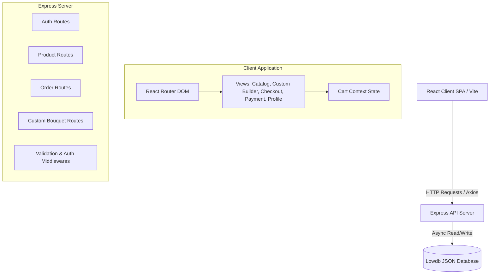
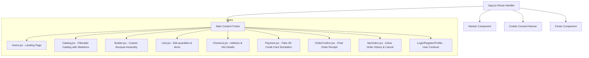

# Petunia Flowershop - Technical Project Documentation

This document provides a comprehensive overview of the architecture, database models, security features, page structures, and team member role allocations for the **Petunia** online flower shop web application.

---

## 1. Project Overview & Tech Stack

**Petunia** is a modern e-commerce web platform for a boutique flower shop, featuring a dynamic catalog, custom bouquet builder, virtual chatbot assistant, secure ordering, and an interactive payment simulation.

### Technology Stack
* **Frontend**: React (v18) built with Vite for speed, utilizing React Router DOM for SPA routing, Lucide React for modern iconography, and standard CSS keyframe animations.
* **Styling**: Tailwind CSS for responsive layouts with a dual-theme config supporting Light Mode (white/pink) and Dark Mode (dark purple/slate).
* **Backend**: Node.js with Express.js managing modular API routing.
* **Database**: Lowdb (v7+)—a lightweight, file-based JSON database (`db.json`) utilizing asynchronous writing mechanisms for fast data CRUD operations.
* **Authentication**: Password encryption via `bcryptjs` and session tokens (represented by client-side local storage and route protections).

---

## 2. System Architecture

The project is designed using a decoupled client-server architecture, keeping the frontend client separated from the backend server.



---

## 3. Database Schema (`db.json`)

The data is split into four primary tables stored in a single JSON structure managed by Lowdb:

### 3.1. Users Table
Stores customer profiles and administrative credentials.
```json
{
  "id": "uuid-string",
  "name": "User Name",
  "email": "user@example.com",
  "phone": "07xxxxxxxx",
  "password": "hashed-bcrypt-string",
  "role": "client | admin",
  "createdAt": "ISO-8601-timestamp"
}
```

### 3.2. Products Table
Manages the inventory of bouquets and plants available in the catalog.
```json
{
  "id": "uuid-string",
  "name": "Bouquet Name",
  "description": "Details about flowers and greenery contents",
  "price": 89.99,
  "category": "trandafiri | lalele | bujori | crizanteme | iris | verdeata | mix | plante",
  "imageUrl": "https://...",
  "stock": 15,
  "isAvailable": true,
  "createdAt": "ISO-8601-timestamp"
}
```

### 3.3. Orders Table
Logs order details, customer delivery requirements, and item quantities.
```json
{
  "id": "uuid-string",
  "userId": "associated-user-uuid",
  "customerName": "Customer Name",
  "customerPhone": "Phone Number",
  "deliveryAddress": "Shipping Address",
  "deliveryDate": "YYYY-MM-DD",
  "items": [
    {
      "productId": "product-uuid",
      "name": "Product Name",
      "price": 89.99,
      "quantity": 2
    }
  ],
  "totalPrice": 179.98,
  "status": "pending | confirmed | delivered | cancelled",
  "note": "Optional delivery notes",
  "createdAt": "ISO-8601-timestamp"
}
```

### 3.4. Bouquets (Custom Builder) Table
Saves custom-built floral arrangements designed by users.
```json
{
  "id": "uuid-string",
  "userId": "associated-user-uuid",
  "name": "My Custom Arrangement",
  "flowers": [
    { "flower": "Trandafir rosu", "quantity": 5, "color": "#e63946" },
    { "flower": "Lalele albe", "quantity": 3, "color": "#f1faee" }
  ],
  "wrapColor": "#a8dadc",
  "totalStems": 8,
  "estimatedPrice": 65.00,
  "createdAt": "ISO-8601-timestamp"
}
```

---

## 4. Backend Architecture & API Routes

The backend server is split into clean, modular route controllers under the `/server/routes` directory:

```
/server
  ├── db/
  │   ├── index.js          # Lowdb adapter configuration
  │   └── db.json           # JSON Database instance
  ├── middleware/
  │   └── auth.js           # Authentication & token verification middleware
  ├── routes/
  │   ├── auth.js           # Registration, login & profile details APIs
  │   ├── products.js       # Product lookup, filtering & search logic
  │   ├── orders.js         # Order placement, list, and cancellation status endpoints
  │   └── bouquets.js       # Custom arrangement database storage
  ├── index.js              # Express main file (cors, json middleware)
  └── seed.js               # Initial database seeder
```

### 4.1. Key Route Descriptions
* **`POST /api/auth/register`**: Validates registration parameters. Checks standard email regex (`/^[^\s@]+@[^\s@]+\.[^\s@]+$/`) and password strength (requires at least 8 characters, containing 1 uppercase letter, 1 lowercase letter, and 1 digit). Encrypts password using `bcryptjs` before insertion.
* **`GET /api/products`**: Serves catalog products. Supports querying parameters `search` (case-insensitive substring lookup matched on name and description) and `category` (exact string match).
* **`POST /api/orders`**: Checks user authorization, validates checkout items against current database stock, and decrements product stock sizes as the order goes through.
* **`PUT /api/orders/:id/cancel`**: Grants clients permission to cancel their orders if the current state is `"pending"`. It automatically restores stock quantities in the products catalog upon cancellation.

---

## 5. Frontend Client Architecture

The frontend is built as a single-page application using React Router.



### 5.1. Major Client Features
* **Debounced Server Search**: Key updates in the catalog search input are debounced by `250ms` before triggering api fetch, avoiding excess requests to the server on every keystroke.
* **Skeleton Loading States**: While waiting for API fetches, [Catalog.jsx](file:///C:/pc fac/github/Petunia/client/src/pages/Catalog.jsx) displays animated pulse placeholder cards to enhance user experience.
* **Global Cart Context**: [CartContext.jsx](file:///C:/pc fac/github/Petunia/client/src/context/CartContext.jsx) manages global cart items, handles quantity arithmetic increment/decrement checks, and clears user-custom states upon successful addition.
* **Interactive 3D Payment**: [Payment.jsx](file:///C:/pc fac/github/Petunia/client/src/pages/Payment.jsx) simulates a real credit card interface using CSS transforms. Entering card credentials rotates the card, highlighting security codes on the back with mock animations.
* **Floating Assistant Bot**: [ChatbotRecommend.jsx](file:///C:/pc fac/github/Petunia/client/src/components/ChatbotRecommend.jsx) provides users with filters (occasions, colors, budget limits, flower varieties) and uses a recommendation algorithm to match products.

---

## 6. Team Division of Labor (3 Members)

For the project presentation and team evaluation, the codebase development, styling layout, and logic integrations are divided among **three team members** as follows:

```
                       TEAM MEMBER ASSIGNMENT CHART
┌───────────────────────────────────┬───────────────────────────────────┬───────────────────────────────────┐
│        [TEAM MEMBER NAME 1]       │        [TEAM MEMBER NAME 2]       │        [TEAM MEMBER NAME 3]       │
│        Frontend Architect         │         Backend Engineer          │         Full-Stack Integrator     │
├───────────────────────────────────┼───────────────────────────────────┼───────────────────────────────────┤
│ • Layout Design & Branding        │ • Server & Route Development      │ • Global Cart Context State       │
│ • Client Router & Layout          │ • Database Setup & Lowdb Config   │ • Custom Bouquet Builder          │
│ • Catalog Views & debounced input │ • Registration Security Check     │ • Fake 3D Card Payment Simulation │
│ • Light/Dark Theme Switcher       │ • Product Search Endpoint Logic   │ • Chatbot Recommendation Panel    │
│ • CSS Page Transition Animations  │ • Order Cancellation Stock Return │ • Skeleton Loader Components      │
└───────────────────────────────────┴───────────────────────────────────┴───────────────────────────────────┘
```

---

### Member 1: Frontend Architect & UI/UX Developer
* **Responsibilities**: Responsible for defining the branding, styling tokens, routing framework, layout templates, responsive grid architectures, and theme transition systems.
* **Key Deliverables**:
  1. **Router & Navigation**: Created the routing structure in [App.jsx](file:///C:/pc fac/github/Petunia/client/src/App.jsx) and the dynamic desktop/mobile [Navbar.jsx](file:///C:/pc fac/github/Petunia/client/src/components/Navbar.jsx) and [Footer.jsx](file:///C:/pc fac/github/Petunia/client/src/components/Footer.jsx).
  2. **Theming Framework**: Implemented CSS variables in [index.css](file:///C:/pc fac/github/Petunia/client/src/index.css) to support Light Mode (warm pink details) and Dark Mode (deep purple accents) toggled via a global theme class.
  3. **Visual Pages & Transition Animations**: Designed [Home.jsx](file:///C:/pc fac/github/Petunia/client/src/pages/Home.jsx), [ProductDetail.jsx](file:///C:/pc fac/github/Petunia/client/src/pages/ProductDetail.jsx), and [Profile.jsx](file:///C:/pc fac/github/Petunia/client/src/pages/Profile.jsx), implementing page-in fade animations (`.animate-page`).
  4. **Catalog Interfaces**: Crafted the initial [Catalog.jsx](file:///C:/pc fac/github/Petunia/client/src/pages/Catalog.jsx) catalog view and the product presentation card [ProductCard.jsx](file:///C:/pc fac/github/Petunia/client/src/components/ProductCard.jsx).

---

### Member 2: Backend Engineer & Database Administrator
* **Responsibilities**: Responsible for managing data models, setting up database seed profiles, writing RESTful server endpoints, and implementing server-side security checks.
* **Key Deliverables**:
  1. **Database Config & Seeding**: Configured the Lowdb JSON database driver in `server/db/index.js` and wrote the database initializer script `server/seed.js`.
  2. **Security & Authentication API**: Wrote endpoints in `server/routes/auth.js` with password hashing (`bcryptjs`) and validated register requests to block weak passwords.
  3. **Backend Search & Filter API**: Implemented search functionality directly in the `server/routes/products.js` router to return matches based on search term or category.
  4. **Order Management Controls**: Designed the cancellation API in `server/routes/orders.js` that checks if an order is cancellable, toggles its state, and increments product stock levels in the JSON storage.

---

### Member 3: Full-Stack Integrator & Feature Developer
* **Responsibilities**: Responsible for state management, interactive client controls, validation flows, checkout integration, and helper widgets.
* **Key Deliverables**:
  1. **Shopping Cart Logic**: Created the [CartContext.jsx](file:///C:/pc fac/github/Petunia/client/src/context/CartContext.jsx) global hook, implementing quantity adjustments directly inside [Cart.jsx](file:///C:/pc fac/github/Petunia/client/src/pages/Cart.jsx) and synchronizing with stock limits.
  2. **Custom Bouquet Builder**: Engineered [Builder.jsx](file:///C:/pc fac/github/Petunia/client/src/pages/Builder.jsx) to compile custom arrangements (calculating stem limits, price adjustments, and resetting builder fields upon cart addition).
  3. **3D Payment Interface**: Built the mock 3D payment simulator [Payment.jsx](file:///C:/pc fac/github/Petunia/client/src/pages/Payment.jsx), capturing inputs to trigger the interactive card flip, verifying fields, and resetting the cart on success.
  4. **Assistant Recommendations Panel**: Developed [ChatbotRecommend.jsx](file:///C:/pc fac/github/Petunia/client/src/components/ChatbotRecommend.jsx) which computes scoring algorithms client-side, suggesting flowers based on occasion chips.
  5. **Skeleton Loaders**: Integrated responsive card skeleton screens into [Catalog.jsx](file:///C:/pc fac/github/Petunia/client/src/pages/Catalog.jsx) to make API fetching visually seamless.

---

## 7. Presentation Guideline & Demo Flow

When demonstrating the application to the panel, walk through the features in this order to highlight the team's combined efforts:

1. **Branding & Theme (Showcases Member 1's work)**: Open the homepage, show the layout transitions, and toggle Dark Mode to showcase the color transitions from white/pink to purple/slate.
2. **Registration Check (Showcases Member 2's validation)**: Try to register a user with a weak password (e.g., `123`) to show the backend check and custom error dialogs. Then register with a secure password (`Test123!`).
3. **Filter & Search Loading (Showcases Member 3's loading & Member 2's search)**: Navigate to the catalog, type in the search bar (observing debounced updates and the custom skeleton loaders) to filter products on the server side.
4. **Flower Builder (Showcases Member 3's custom builder)**: Add some flowers in the interactive bouquet builder, add it to the cart, and show that the builder state resets correctly.
5. **Checkout & 3D Payment (Showcases Member 3's payment & Member 2's stock operations)**: Fill out the order details, enter fake credentials in the 3D card layout (notice the card rotating animation), and submit.
6. **Order Cancellation (Showcases Member 3's client UI & Member 2's API database logic)**: Go to the client order page, cancel the order, and show that the cancelled status updates instantly, restoring the flower counts on the server catalog.
